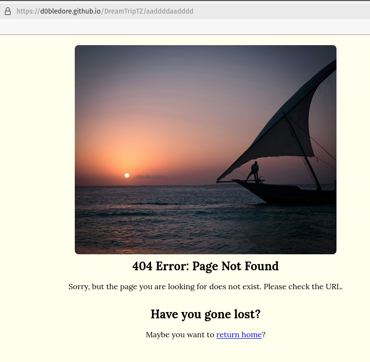

# [DREAMTRIPTZ](https://d0bledore.github.io/DreamTripTZ)

## Introduction

**Welcome to DreamTripTZ: Your Gateway to Tanzania's Hidden Gems**

Imagine a land where endless savannas meet the whispering secrets of the Great Rift Valley, and Zanzibar's beaches glisten under the golden sun. Welcome to Tanzania, a dream destination offering something for everyone.

**Discover Your Perfect Trip with Our Interactive Quiz**

At DreamTripTZ, we provide a unique and engaging way to explore Tanzania's tourism possibilities. Our short quiz helps you uncover the perfect experiences tailored to your interests. Choose from three exciting paths: relaxation, education, and adventure. Each path includes additional questions to refine your preferences, ensuring you find the ideal fit.

**Explore Tanzania's Best Kept Secrets**

Based on your quiz answers, you'll receive a link to a genuine website of a tourist attraction in Tanzania. Whether you're drawn to the majestic Serengeti, the historical allure of Stone Town, or the serene beauty of Zanzibar, our quiz will guide you to your perfect destination.

**Why Choose DreamTripTZ?**

For those unfamiliar with Tanzania, our site offers an opportunity to discover a world of wonder. From the snow-capped peaks of Mount Kilimanjaro to the vibrant markets of Dar es Salaam, Tanzania is a dream destination waiting to be explored. Our quiz ensures you find experiences that truly resonate with your desires.

**Filter Through All Options**

After completing the quiz, you can filter through all the curated results. This feature allows you to explore all options without retaking the quiz, providing a comprehensive view of what Tanzania has to offer.

**Realize Your Dream Vacation**

DreamTripTZ aims to ignite the realization that Tanzania is the ultimate dream destination for tourism. Whether you're seeking a relaxing getaway, an educational journey, or an adventurous escapade, our site is designed to make you feel like you've discovered a hidden gem.

So, why wait? Take the quiz today and find out why Tanzania is the dream destination you've been missing. Let DreamTripTZ guide you to your next unforgettable vacation.

source: [amiresponsive](https://ui.dev/amiresponsive?url=https://d0bledore.github.io/DreamTripTZ)

## UX 

### Color Scheme 

#### Primary Colors

- **Background Color**: The predominant background color for the body and dropdown menu is #ffffee, a soft, light beige. This color provides a neutral and calming backdrop, making it easy on the eyes and allowing other elements to stand out.
    
- **Text Color**: The primary text color is black (#000), which provides a strong contrast against the light beige background, ensuring readability and clarity.

#### Accent Colors

- **Logo Background**: The logo showcases a complex linear gradient that combines multiple colors reminiscent of the Tanzanian flag. This immediately highlights the site's theme.

- **Button Color**: The "Up Button" uses seagreen as its background color, paired with white text. Seagreen is a calming and refreshing color, often associated with nature and tranquility.

#### Footer and Links

- **Footer Background**: The footer has a dark, nearly black background (rgba(0, 0, 0, 0.95)), which provides a strong base and helps anchor the design visually. The text and links in the footer are white, offering high contrast for readability.

- **Link Hover Effects**: Links change to rgb(0, 110, 255) on hover, a bright blue that stands out against the dark footer background, indicating interactivity. This color is commonly associated with hyperlinks and helps guide user interaction.

#### Hover Effects 

- **General Hover Effects**: For elements like buttons and the #label-toggler (the label element which opens a dropdown menu), the hover background color is rgb(202, 202, 202), a light gray. This subtle change provides visual feedback without being too distracting, maintaining the overall elegance of the design.

#### Overall Design Aesthetic

The overall color scheme is balanced and professional, using neutral tones as a foundation while incorporating green and blue accents to add depth and interest. This combination can evoke feelings of calmness, reliability, and sophistication, making it suitable for a wide range of applications, from corporate websites to personal blogs. The strategic hover effects enhances user engagement and ensures that important elements are easily noticeable.

### Typography 

- **Google Font "Lora"**: The font "Lora" is imported from Google Fonts and applied to the entire document through the body selector. This serif font is known for its readability and classic appearance, suitable for both body text and headings.

## Features 

### Existing Features

#### Main Features 

- **Quiz to Your Dream Trip** 

The primary goal of the site is to offer a quiz that guides users to their dream trip in Tanzania. Users can choose from three ideal trip scenarios: Education, Relaxation, or Adventure. Based on their selection, the quiz will further refine the options to provide a personalized match for the user.

- **Resources to each Result** 

The essence of this concept is to demonstrate the diverse tourism opportunities available in this East African nation. The highlight is the real resources provided at the end of the quiz, which direct users to an external site offering tailored tourism options. Whether it's climbing Mount Kilimanjaro, visiting Zanzibar, or exploring Swahili poetry events, the site ensures users can go beyond just taking a quiz.

- **Results filter and filter options** 

For added convenience, after completing the quiz, users have the option to visit the filter section. Here, they can view all results for each of the three ideal trip scenarios. Additionally, two popular choices—Serengeti National Park and the Island Paradise Zanzibar—are highlighted. To enhance the user experience, the site offers two handy options: "Clear Text" and "All Options," providing an easy filtering mechanism. The overall aim is to make the site as pleasant and user-friendly as possible.

 

#### Navigation Features

- **Call to Action Options** 

The call to action options on the landing page are designed to immediately engage users, encouraging them to take the quiz and discover where their dream trip could lead them. 

- **Menu Navigation** 

For desktop and tablet screen sizes, the menu navigation allows users to easily switch between the filter and quiz sections, ensuring a seamless browsing experience.

- **Mobile Menu Dropdown Navigation** 

On smaller screens, the mobile menu dropdown provides a toggle feature that facilitates navigation between the filter and quiz sections, maintaining ease of use on mobile devices

- **The Logo as a Home Button** 

The logo also functions as a home button, offering users a quick way to return to the homepage or refresh the site if they feel lost or wish to start over. This feature enhances user experience by providing an intuitive navigation option.

- **The Up-Button** 

Finally, the intuitive "go up" option, which appears on the left side (convenient for the majority of right-handed users), allows for easy navigation when browsing the filter section. This design choice enhances user-friendliness.

#### Error Page 

- **Custom made Error page** 

A valuable feature for any website is a custom error page that appears when users enter an incorrect URL. This page features a serene image of a lone boat on the open Indian Ocean, evoking a sense of solitude and contemplation, as if the user had become lost.
It includes a hyperlink allowing users to easily return to the index.html page.

### Future Features 

To be continued .. 

## Tools & Technologies Used

-  used to generate README and TESTING templates.
-  used for version control. (`git add`, `git commit`, `git push`)
-  used for secure online code storage.
-  used as my local IDE for development.
-  used for the main site content.
-  used for the main site design and layout.
-  used for user interaction on the site.
-  used for hosting the deployed front-end site.
-  used to help debug, troubleshoot, and explain things.

## Testing

> **Note:**  
> For all testing, please refer to the [TESTING.md](TESTING.md) file.

## Deployment

The site was deployed to GitHub Pages. The steps to deploy are as follows:

- In the [GitHub repository](https://github.com/D0bledore/DreamTripTZ), navigate to the Settings tab 
- From the source section drop-down menu, select the **Main** Branch, then click "Save".
- The page will be automatically refreshed with a detailed ribbon display to indicate the successful deployment.

The live link can be found [here](https://d0bledore.github.io/DreamTripTZ)

### Local Deployment

#### Cloning

You can clone the repository by following these steps:

1. Go to the [GitHub repository](https://github.com/D0bledore/DreamTripTZ) 
2. Locate the Code button above the list of files and click it 
3. Select if you prefer to clone using HTTPS, SSH, or GitHub CLI and click the copy button to copy the URL to your clipboard
4. Open Git Bash or Terminal
5. Change the current working directory to the one where you want the cloned directory
6. In your IDE Terminal, type the following command to clone my repository:
	- `git clone https://github.com/D0bledore/DreamTripTZ.git`
7. Press Enter to create your local clone.

Alternatively, if using Gitpod, you can click below to create your own workspace using this repository.

Please note that in order to directly open the project in Gitpod, you need to have the browser extension installed.
A tutorial on how to do that can be found [here](https://www.gitpod.io/docs/configure/user-settings/browser-extension).

#### Forking

By forking the GitHub Repository, we make a copy of the original repository on our GitHub account to view and/or make changes without affecting the original owner's repository.
You can fork this repository by using the following steps:

1. Log in to GitHub and locate the [GitHub Repository](https://github.com/D0bledore/DreamTripTZ)
2. At the top of the Repository (not top of page) just above the "Settings" Button on the menu, locate the "Fork" Button.
3. Once clicked, you should now have a copy of the original repository in your own GitHub account!

### Local VS Deployment

There is no difference between the local version and the deployed version on github pages. 

## Credits

### Content

| Source | Location | Notes |
| --- | --- | --- |
|  | README and TESTING | tool to help generate the Markdown files |
|  | CSS Stylesheet | logo tanzanian flag background | 
|  | quiz_data.js | created the quizData object structure |

### Media

| Source | Location | Type | Notes |
| --- | --- | --- | --- |
| [Wikipedia](https://upload.wikimedia.org/wikipedia/commons/3/38/Flag_of_Tanzania.svg) | entire site | image | favicon on all pages |
| [Unsplash](https://unsplash.com/photos/a-tall-building-with-lots-of-windows-and-palm-trees-nPjaO3Cn62Y) | landing page | image | a tall building with lots of windows and palm trees |
| [Unsplash](https://unsplash.com/photos/a-person-standing-on-a-boat-in-the-ocean-at-sunset-TD3iWOhMRI8) | 404 Page | image | A person standing on a boat in the ocean at sunset |

#### Quiz Media 

Upon selecting a quiz option, the image changes accordingly:  

| Source | Location | Type | Notes |
| --- | --- | --- | --- |
| [Pixabay](https://pixabay.com/illustrations/tanzania-flag-grunge-africa-1242282/) |  quiz start | image | tanzania flag grunge |
| [Unsplash](https://unsplash.com/photos/airplane-on-sky-during-golden-hour-M0AWNxnLaMw) | quiz choose ideal trip | image | airplane on sky during golden hour |
| [Unsplash](https://unsplash.com/photos/a-white-couch-in-a-room-zfKp8y7TRj0) | quiz relaxation | image | a white hanging bed |
| [Unsplash](https://unsplash.com/photos/rule-of-thirds-photography-of-lit-candle-UiMkBvDQSAA) | quiz relaxation spa | image | close-up of an oil burner with a lit candle |
| [Freepik](https://www.freepik.com/free-photo/aerial-view-blissful-zanzibar-region-tanzania-east-africa_17290271.htm#query=tanzania&position=21&from_view=keyword&track=sph&uuid=3e34d72e-da6d-441e-a5a6-b4d86f00f2fd)| quiz relaxation beach | image | Zanzibar Beach Image |
| [Unsplash](https://unsplash.com/photos/a-view-of-a-mountain-range-from-a-distance-1NKGDyGwA6c) | quiz relaxation mountain | image | panoramic mountain landscape |
| [Unsplash](https://unsplash.com/photos/giraffe-standing-on-brown-grass-field-during-daytime-bLxPZkqBwxw) | quiz adventure | image | giraffe spotting out of safari car |
| [Unsplash](https://unsplash.com/photos/a-giraffe-standing-in-the-middle-of-a-forest-E1UwiW268FU) | quiz adventure mild | image | A giraffe poking its head out. |
| [Unsplash](https://unsplash.com/photos/green-and-yellow-wooden-house-on-lake-fNlQ5Gpq1kM) | quiz adventure moderate | image | camping tent in the jungle |
| [Unsplash](https://unsplash.com/photos/a-view-of-a-snow-covered-mountain-from-a-building-xev2kb8paN4) | quiz adventure intense | image | mount Kilimanjaro |
| [Unsplash](https://unsplash.com/photos/a-wooden-statue-sitting-on-top-of-a-wooden-table-A7hPZMY23-g) | quiz education | image | wooden statue sitting on top of wooden table |
| [Unsplash](https://unsplash.com/photos/an-alley-way-with-a-building-and-a-clock-on-the-side-of-it-dWkpjQ7drlg) | quiz education history | image | Stone Town Zanzibar |
| [Unsplash](https://unsplash.com/photos/a-book-shelf-filled-with-lots-of-books-Ru06y_F6xKo) | quiz education science  | image | a book shelf filled with science books |
| [Unsplash](https://unsplash.com/photos/a-bunch-of-different-colored-twine-on-display-4JcSQdVAbAw) | quiz education arts | image | a bunch of different colored twine on display |

#### Media compression 

| Source | Location | Type | Notes |
| --- | --- | --- | --- |
| [TinyPNG](https://tinypng.com) | entire site | image | tool for image compression |

### Acknowledgments

I would like to express my heartfelt gratitude to my Code Institute mentor, [Tim Nelson](https://github.com/TravelTimN), for his unwavering support and guidance throughout the development of this project. His expertise and encouragement have been invaluable.

I am also deeply thankful to the [Code Institute](https://codeinstitute.net) for providing me with this incredible opportunity to advance my career. The skills and knowledge I have gained through this program have been transformative.

Lastly, I want to extend my deepest appreciation to my partner, **Rose**, for her unwavering belief in me. Her encouragement led me to discover the Code Institute and apply for the Full-Stack Software Development Course, which has been a pivotal step in my professional journey.

Last but not least, I thank God for providing me with the strength and perseverance to complete this project, especially while managing the demands of a tough job alongside my studies.

