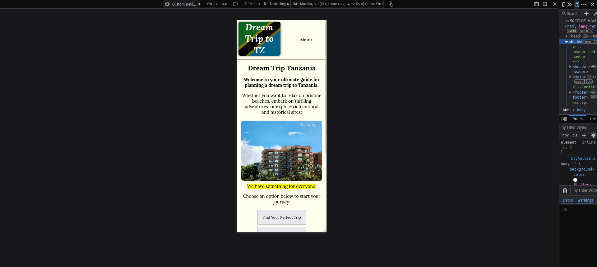
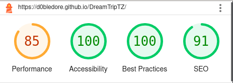
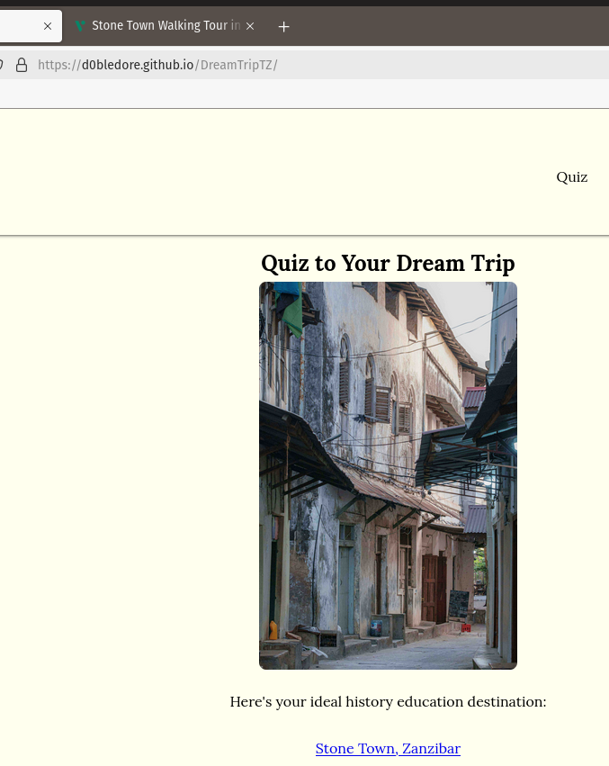

# Testing

> **Note:**  
> Return back to the [README.md](README.md) file.

## Code Validation

### HTML

I have used the recommended [HTML W3C Validator](https://validator.w3.org) to validate all of my HTML files.

| Directory | File | Screenshot | Notes | 
| --- | --- | --- | --- |
|  | 404.html |  | No Errors |
|  | index.html |  | No Errors |

### CSS

I have used the recommended [CSS Jigsaw Validator](https://jigsaw.w3.org/css-validator) to validate all of my CSS files.

| Directory | File | Screenshot | Notes |
| --- | --- | --- | --- |
| assets/css | style.css |  | No Error Found |

### JavaScript

I have used the recommended [JShint Validator](https://jshint.com) to validate all of my JS files.

| Directory | File | Screenshot | Notes |
| --- | --- | --- | --- |
| assets/js | quiz_data.js |  | No Warnings or Errors |
| assets/js | script.js |  | Four Warnings but they are not game breaking |

## Browser Compatibility

I tested the live/deployed version of my site on the following browsers: 

- [Ungoogled Chrome](https://www.techspot.com/downloads/7181-ungoogled-chromium.html)
- [Firefox](https://www.mozilla.org/firefox/download/)
- [Brave](https://brave.com/download)
- [Opera](https://www.opera.com/download)

I've tested my deployed project on multiple browsers to check for compatibility issues.

| Browser | Landing Page | Quiz Section (with options) | Filter Section (with results) | Notes |
| --- | --- | --- | --- | --- |
| Ungoogled Chromium |  |  |  | Works as expected |
| Firefox |  |  |  | Works as expected |
| Brave |  |  |  | Works as expected |
| Opera |  |  |  | minor visual differences on buttons (as expected) |

## Responsiveness

I've tested my deployed project on multiple devices to check for responsiveness issues.

| Device | Landing Page | Quiz Section (with options) | Filter Section (with results) | Notes |
| --- | --- | --- | --- | --- | 
| Mobile (DevTools) |  |  |  | Works as expected |
| Tablet (DevTools) |  |  |  | Works as expected |
| Desktop |  |  |  | Works as expected |

## Lighthouse Audit

I've tested my deployed project using the Lighthouse Audit tool to check for any major issues.

| Page | Mobile | Desktop | Notes |
| --- | --- | --- | --- |
| index.html |  |  | performance impact due to high resource loading |
| 404.html |  |  |  performance impact due to high resource loading  | 

**Comment**:

I am using a lot of images on one page in this project. I could change all images to formats like WebP and AVIF which provide better compression than PNG or JPEG to improve performance. 

## Feature testing

This section outlines the testing procedures for the key features of the project, focusing primarly on the **Quiz** and **Filter** functionalities. The aim is to ensure these features work as intended, providing users with a seamless and engaging experience.

- **Quiz**: An interactive component that guides users through a series of questions to determine their ideal travel experience.
- **Filter**: A feature that allows users to explore all potential travel options and refine their choices based on specific criteria.

## Testing Procedures

### Quiz 

> [!NOTE] Please don't miss the < details > elements to see a Table of Proof for both Quiz Functionality and Final Quiz Results

**Navigation to Quiz**:

- I verifed that the quiz can be accessed via the "Find Your Perfect Trip" button on the landing  page and the header navigation link.

- It's important to point out that clicking these options reveals the quiz section without resetting it, allowing users to switch between the quiz and filter sections seamlessly.

**Quiz Functionality**:

- I confirmed that clicking "Take the Test!" starts the quiz and reveals the first set of options (relaxation, adventure, education) along with a new image.
- I verified that each option (relaxation, adventure, education) generates three new buttons and updates the image accordingly.
- I made sure that each subsequent button press continues to reveal new options and images without any console errors.

**TABLE OF PROOF**

    
See Table of Proof
  

| Button | Expectation | Result | Screenshot |
| --- |--- | --- | --- |
| 'Take the Test!' | Reveals 3 buttons: relaxation, adventure, education & reveals new image: airplane on sky during golden hour | Pass  |  | 
| relaxation |  Reveals 3 buttons: spa, beach, mountain & reveals new image: a white hanging bed | Pass |  | 
| spa |  Reveals 3 buttons: traditional, wellness, beauty & reveals new image: close-up of an oil burner with a lit candle | Pass |  | 
| beach |  Reveals 3 buttons: warm, hot, mild & reveals new image: Zanzibar Beach Image | Pass |  | 
| mountain |  Reveals 3 buttons: walks, visits, relax & reveals new image: panoramic mountain landscape | Pass |  | 
| adventure |  Reveals 3 buttons: mild, moderate, intense & reveals new image: giraffe spotting out of safari car | Pass |  | 
| mild |  Reveals 3 buttons: guides, tours, cultures & reveals new image: a giraffe poking its head out | Pass |  | 
| moderate |  Reveals 3 buttons: water, land, both & reveals new image: camping tent in the jungle | Pass |  | 
| intense |  Reveals 3 buttons: climbing, rafting, wilderness & reveals new image: mount Kilimanjaro | Pass |  | 
| education |  Reveals 3 buttons: history, science, arts & reveals new image: statue sitting on top of wooden table | Pass |  | 
| history |  Reveals 3 buttons: archaeology, indigenous, colonial & reveals new image: Stone Town Zanzibar | Pass |  | 
| science |  Reveals 3 buttons: wildlife, farming, biology & reveals new image: a book shelf filled with science books | Pass |  | 
| arts |  Reveals 3 buttons: visual, performance, literature & reveals new image: a bunch of different colored twine on display | Pass |  | 

 

**Final Quiz Results**:

- I confirmed that the final stage of the quiz provides accurate content with the correct corresponding external link.

**TABLE OF PROOF**

> [!NOTE] 'Ras Kutani' is, in fact, both a "hot beach" destination, as well as a traditional spa destination.  

    
See Table of Proof 

| Button | Expected Link content | Result | Screenshot |
| --- | --- | --- | --- | 
| traditional | Ras Kutani | Pass |  | 
| wellness | luxury safari lodge 'one nature Nyaruswiga' in Serengeti | Pass |  | 
| beauty |  the spa at the Residence Zanzibar | Pass |  | 
| warm | Nungwi Beach, Zanzibar | Pass |  | 
| hot | Ras Kutani | Pass | | 
| mild |  Mafia Island | Pass |  | 
| walks | Ngorongoro Crater Lodge | Pass |  | 
| visits | Arusha Coffee Lodge  | Pass |  | 
| relax | Gibb's Farm | Pass |  | 
| guides | Guided safari in Tarangire National Park | Pass |  | 
| tours | Cultural tour to Maasai villages in Ngorongoro Conservation Area | Pass |  | 
| cultures | Coffee plantation experience near Moshi | Pass |  | 
| water | Snorkeling and diving in Zanzibar | Pass |  | 
| land | Horseback riding safaris in the Serengeti | Pass |  | 
| both | Chemka Hot Springs swimming and exploration | Pass |  | 
| climbing | Mount Kilimanjaro climb | Pass |  | 
| rafting | White water rafting on the Rufiji River | Pass |  | 
| wilderness  | Wilderness expedition in Ruaha National Park | Pass |  | 
| archaeolgy |   Oldupai/Olduvai Gorge | Pass |  | 
| indigenous |   Lake Eyasi | Pass |  | 
| colonial |   Stone Town, Zanzibar | Pass |  | 
| wildlife | Serengeti National Park research center | Pass |  |
| farming | Mulala village tour | Pass |  |
| biology | Udzungwa Mountains National Park (biodiversity hotspot) | Pass |  |
| visual | Tingatinga painting workshops in Dar es Salaam | Pass |  |
| performance | Traditional dance performances in Bagamoyo | Pass |  |
| literature | Swahili poetry and storytelling sessions in Zanzibar | Pass |  |

 

- The result links open in a new tab, as hardcoded in JavaScript. See image below.

###  Filter

**Accessing the Filter**:

- After completing the quiz, I navigated successfully to the filter section with the 'Search all Results' Option. 

**Filter Options**:

- I checked that the buttons for popular destinations 'Serengeti' and 'Zanzibar' are working.  
- I tested the "Clear Text" and "All Options" buttons to ensure they facilitate easy filtering and enhance the user experience.
- I checked that clicking the filter results button for 'Relaxation', 'Adventure', and 'Education' are working and providing accurete results, matching the Quiz Final Results. 
- I tested each button with multiple clicks to ensure that bug free buttons. 

**Filter Results counter**:

- I tested the results counter function with various terms to check that the text display would update dynamically. 
- I made sure that the results counter would reset to 0 when clearing the the text input or pressing the 'Clear Text' button option. 

### Additional Features for Testing

#### Navigation Features
        
**Call to Action**: 

I tested that the landing page's call-to-action options effectively starts the quiz.
        
**Menu Navigation**:

I can verify that the menu allows easy switching between the quiz and the filter section on desktop and tablet devices.
        
**Mobile Dropdown**:

I tested the mobile menu dropdown, it is working. 

**Home Button**:

I confirmed that the logo functions as a home button, allowing users to return to the homepage or refresh the site.

**Up-Button**:

- I verified that the "Go up!" option successfully apears at a certain time when scrolling. I tested it on mobile and desktop devices.
- I tested the 'Go up!' button to sucessfully take the user to the top of the page. 

#### Error Page

- I tested the custom error page by entering an incorrect URL, ensuring it displays the intended image and provides a hyperlink back to the homepage.
- I tested that the hyperlink takes the user back to index.html page. 

### Conclusion

I ensure that all interactive elements and navigation features are thoroughly evaluated for functionality and user experience

## Bugs

### Text Input Field Page Reset 

Initially, I used a form element in HTML to implement an easy reset button for the text input area. However, this became redundant when JavaScript was introduced.

The bug was that, due to the form elements, hitting enter in the text input area caused the site to reset, redirecting the user back to the landing page. This was particularly frustrating for mobile users, who would press enter to exit the input box and view results. Replacing the redundant form elements with div elements resolved the issue. Now, the form does not reset because there is no form anymore.

I tested the filtering functionality after the replacement to ensure it worked as expected. 

### Unexpected Filtering Results 

The filtering functioned similarly for all search input buttons. They were, in fact, written with the same switch statement, as shown below:

However, for some reason, the filtering options for 'Education,' 'Relaxation,' and 'Adventure' behaved differently. When a user clicked one of these buttons twice, the output would toggle between two different results.

See the table of comparison: 

| Button | First Click | Second Click | 
| --- | --- | --- | 
| Relaxation |  |  | 
| Education |  |  | 
| Adventure |  |  | 

The reason for this behavior was unclear, even after fixing it, but it might have been related to the HTML. I previously used 'hidden' span elements with the words 'Relaxation,' 'Education,' or 'Adventure' to reveal these results with the search function. The search function initially revealed each div element with the class 'destination' that included the searched word. I later modified my HTML to remove all spans, adding classes to each destination with the corresponding name and path, and refactored the search function to reveal destinations with the included class. This resolved the issue. However, the input did not change, so theoretically, it should not have behaved as it did. Because the switch statement overrides the input text value, if the word 'Education' is included in the innerHTML of the div 'destination,' it should reveal these destinations. Clicking it again should not cause it to disappear completely, as the input value does not change. It was impossible to trace this bug with a console.log statement, so it remains a mystery.

## Unfixed Bugs

> **NOTE**  
> There are no remaining bugs that I am aware of.
